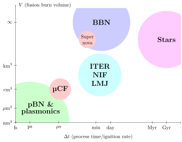

# fusion-insights
Science Of Nuclear Fusion: Insights and Ideas

  

## abstract
Advances in several physics domains open up novel paths to smaller scale, higher energy density opportunities to advance small systems for nuclear fusion. Here we survey both legacy and several novel "table-top" approaches which attract current interest. We furthermore address a few related practical and challenging nuclear science topics arising in the context of magnetic confinement and inertial confinement fusion. The contents emphasis includes: By example of solar fusion cycles we draw attention to aneutronic fusion reaction chains. Considering the natural isotopic abundances we assess more carefully the meaning of the term "limitless energy" in the context of actual fusion power realizations. We describe achievements in laser-driven proton-boron fusion, and extensions to a self-sustaining and nearly fully aneutronic proton-boron-nitride reaction cycle. We propose another aneutronic option, where the target is a mix of beryllium and light helium isotope; this 3-helium is arguably the most mentioned fusion component in this article. We look in depth at the plasmonic opto-electric field-enhancement for fusion, and at the particle (muon) catalyzed fusion option. We describe problems in harnessing the *dt* fusion for civilian use. We introduce space travel as forthcoming application of aneutronic fusion.

## authors
<a
id="cy-effective-orcid-url"
class="underline"
href="https://orcid.org/0000-0001-8217-1484"
target="orcid.widget"
rel="me noopener noreferrer"
style="vertical-align: top"> Johann Rafelski</a> and <a
id="cy-effective-orcid-url"
class="underline"
href="https://orcid.org/0000-0001-5474-2649"
target="orcid.widget"
rel="me noopener noreferrer"
style="vertical-align: top"> Andrew J. Steinmetz</a>

## cite as
Rafelski, J. & Steinmetz, A. J. Science Of Nuclear Fusion: Insights and Ideas. arXiv:2609.01366 [nucl-th] (2026).

Submitted to the special issue ["Particles and Plasmas in Strong Fields, Part 2"](https://www.mdpi.com/journal/particles/special_issues/C8XU54WI5Z) of *Particles*.

## doi/arXiv id
- https://arxiv.org/abs/2609.01366
- https://doi.org/10.48550/arXiv.2609.01366

## contents
- `aneutronic-fusion-v3.tex`, `aneutronic-fusion-v3.bib`, `aneutronic-fusion-v3.bbl` -- manuscript source and bibliography.
- `anc/TikZ/` -- TikZ sources for the figures compiled into the manuscript.
- `anc/NACREII/` -- NACRE II reaction rate tables (`nacre_*.csv`) with the cross-section and reactivity scripts built on `nacre_reactivity.py`.
- `anc/EXFOR/` -- EXFOR retrieval (`fetch_exfor.sh`) and peak cross-section extraction (`exfor_peaks.py`), Bosch-Hale parameterizations (`bosch_hale.py`), and the optimal ³He spike fraction calculation (`he3_spike_optimum.py`).
- `art/` -- graphical abstract shown above.

## license
Copyright © 2026 by the authors.

This preprint is distributed under the [arXiv.org perpetual, non-exclusive license 1.0](http://arxiv.org/licenses/nonexclusive-distrib/1.0/).
